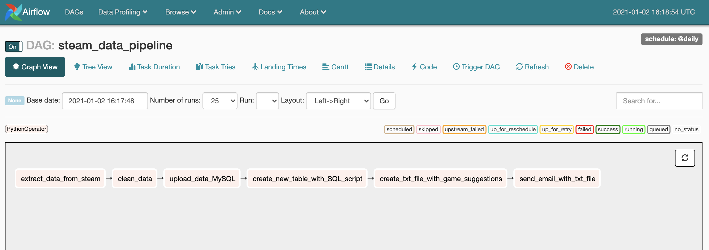

# Steam_Alert_Deals

## Project Description: ##
This project utilizes various technologies like Apache Airflow, DAGs, Jupyter Notebook, Pandas, MySQL and AWS S3 to build
an end to end data pipeline for extracting data using Web Scraping and then processing the data in the pipeline by using
Jupyter Notebook and Pandas. The final output is uploaded on an AWS S3 bucket. The pipeline is scheduled to run on a daily basis.

## Use Case: ##
I wanted to automate the process of looking at Steam's website for daily discounts on PC games. This
data pipeline will extract the data through web scraping off Steam's website, clean the data, and then
send me an email with a list of discounted games that meet my predefined specifications (e.g. send me all
"free to play" games) using MySQL scripts.

## How it Works: ##
(In Progress)

## Technologies Used: ## 
  * Python 
  * Pandas
  *	Jupyter Notebook
  *	Apache Airflow
  *	DAGs
  *	MySQL
  *	AWS S3

